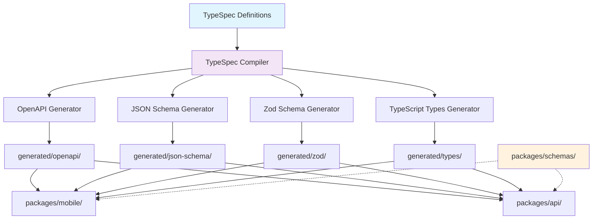

# Technical Design

## Overview

TypeSpec中央管理システムは、モノリポ内でTypeSpec定義を統一管理し、OpenAPI、JSON Schema、Zodスキーマを自動生成する統合システムです。現在のOpenAPIベースのスキーマ管理（`packages/schemas/`）と並行して運用し、段階的な移行を可能にします。

## Architecture



## Technology Stack

- **TypeSpec Core**: @typespec/compiler, @typespec/http, @typespec/rest
- **Code Generation**: @typespec/openapi3, @typespec/json-schema
- **Validation**: Zod schema generation via custom emitter
- **Build System**: TypeScript, npm scripts
- **File Watching**: chokidar for watch mode development
- **Documentation**: Swagger UI, static HTML generation

## Components and Interfaces

### TypeSpec Package Structure (`packages/api-specs/`)

```typescript
type ApiSpecsPackage = {
  // Package configuration
  packageJson: {
    name: "@soyokaze/api-specs";
    dependencies: TypeSpecDependencies;
    scripts: CompilationScripts;
  };
  
  // TypeSpec configuration
  tspConfig: {
    outputDir: "./generated";
    emitters: EmitterConfig[];
  };
  
  // Source definitions
  specs: {
    main: "main.tsp";           // Entry point
    models: ModelDefinitions;    // Data models
    services: ServiceDefinitions; // API endpoints  
    lib: CommonDefinitions;      // Shared utilities
  };
  
  // Generated outputs
  generated: {
    openapi: OpenAPISchemas;
    jsonSchema: JSONSchemas;
    zod: ZodSchemas;
    types: TypeDefinitions;
  };
}
```

### TypeSpec Definition Organization

```typescript
// models/user.tsp
type UserModel = {
  id: string;
  name: string;
  email: string;
  createdAt: utcDateTime;
  updatedAt: utcDateTime;
}

// services/user-api.tsp
type UserService = {
  @route("/users")
  @get listUsers(): UserModel[];
  
  @route("/users/{id}")
  @get getUser(@path id: string): UserModel;
  
  @route("/users")
  @post createUser(@body user: CreateUserRequest): UserModel;
}
```

## API Endpoints

TypeSpecから生成されるAPI仕様は以下の形式に従います：

```yaml
# Generated OpenAPI structure
/api/users:
  GET:
    summary: List users
    responses:
      200:
        schema: { $ref: "#/components/schemas/UserModel[]" }
  POST:
    summary: Create user
    requestBody:
      schema: { $ref: "#/components/schemas/CreateUserRequest" }
    responses:
      201:
        schema: { $ref: "#/components/schemas/UserModel" }

/api/users/{id}:
  GET:
    summary: Get user by ID
    parameters:
      - name: id
        in: path
        required: true
        schema: { type: string }
    responses:
      200:
        schema: { $ref: "#/components/schemas/UserModel" }
```

## Data Flow

1. **Definition Phase**: 開発者がTypeSpecファイル（`.tsp`）でAPIとモデルを定義
2. **Compilation Phase**: TypeSpecコンパイラが定義を解析し、中間表現を生成
3. **Generation Phase**: 複数のEmitterが並行して異なる形式のスキーマを生成
4. **Distribution Phase**: 生成されたスキーマが各パッケージから参照される
5. **Validation Phase**: ランタイムでZodスキーマによる型検証が実行される

## Data Models

### TypeSpec Core Models

```typescript
// Generated TypeScript types
type UserModel = {
  id: string;
  name: string;
  email: string;
  createdAt: string; // ISO 8601 datetime
  updatedAt: string; // ISO 8601 datetime
}

type CreateUserRequest = {
  name: string;
  email: string;
}

// Generated Zod schemas
const UserModelSchema = z.object({
  id: z.string(),
  name: z.string(),
  email: z.string().email(),
  createdAt: z.string().datetime(),
  updatedAt: z.string().datetime(),
});

type UserModel = z.infer<typeof UserModelSchema>;
```

### Package Integration Schema

```typescript
// packages/mobile/models/generated.ts
export { UserModel, UserModelSchema } from "@soyokaze/api-specs/generated/zod";

// packages/api/src/types/generated.ts  
export { UserModel } from "@soyokaze/api-specs/generated/types";
```

## Error Handling

### Compilation Errors

```typescript
type CompilationError = {
  severity: 'error' | 'warning';
  code: string;
  message: string;
  file: string;
  line: number;
  column: number;
  suggestion?: string;
}

// Error handling strategy
const handleCompilationErrors = (errors: CompilationError[]) => {
  errors.forEach(error => {
    console.error(`${error.file}:${error.line}:${error.column} - ${error.message}`);
    if (error.suggestion) {
      console.info(`Suggestion: ${error.suggestion}`);
    }
  });
  
  if (errors.some(e => e.severity === 'error')) {
    process.exit(1);
  }
};
```

### Runtime Validation Errors

```typescript
// Zod validation error handling
const validateUserData = (data: unknown): UserModel => {
  try {
    return UserModelSchema.parse(data);
  } catch (error) {
    if (error instanceof z.ZodError) {
      throw new ValidationError('Invalid user data', error.errors);
    }
    throw error;
  }
};
```

## Security Considerations

### Schema Validation
- **Input Validation**: 全てのAPIリクエストでZodスキーマによる検証
- **Output Sanitization**: レスポンスデータの型安全性を保証
- **SQL Injection Prevention**: 型定義によるデータベースクエリの安全性

### Access Control
- **API Documentation**: 内部開発チームのみアクセス可能
- **Generated Files**: バージョン管理対象、読み取り専用として扱う

## Performance & Scalability

### Build Performance
- **Incremental Compilation**: 変更されたファイルのみ再コンパイル
- **Parallel Generation**: 複数出力形式の並行生成
- **Caching Strategy**: コンパイル結果のキャッシュ機構

```typescript
type PerformanceOptimization = {
  incrementalCompilation: true;
  parallelEmitters: 4;
  cacheDirectory: ".tsp-cache";
  watchMode: {
    debounceMs: 300;
    excludePatterns: ["generated/**", "node_modules/**"];
  };
}
```

### Runtime Performance
- **Schema Caching**: Zodスキーマの事前コンパイル
- **Lazy Loading**: 必要時のみスキーマを読み込み
- **Memory Optimization**: 大きなスキーマの分割読み込み

## Testing Strategy

### Unit Testing
```typescript
// TypeSpec definition tests
describe('User Model TypeSpec', () => {
  test('generates valid OpenAPI schema', () => {
    const schema = compileTypeSpec('models/user.tsp');
    expect(schema.components.schemas.User).toBeDefined();
  });
  
  test('generates valid Zod schema', () => {
    const zodSchema = generateZodSchema('models/user.tsp');
    expect(() => zodSchema.parse(validUserData)).not.toThrow();
  });
});
```

### Integration Testing
```typescript
// Cross-package compatibility tests
describe('Schema Integration', () => {
  test('mobile package can import generated schemas', () => {
    const { UserModelSchema } = require('@soyokaze/api-specs/generated/zod');
    expect(UserModelSchema.safeParse).toBeDefined();
  });
  
  test('api package can use generated types', () => {
    const userType: UserModel = { id: '1', name: 'Test', email: 'test@example.com' };
    expect(userType).toMatchSchema(UserModelSchema);
  });
});
```


## Implementation Scripts

### Package Scripts
```json
{
  "scripts": {
    "api-specs:compile": "tsp compile .",
    "api-specs:watch": "tsp compile . --watch",
    "api-specs:validate": "tsp compile . --no-emit",
    "api-specs:clean": "rimraf generated/",
    "api-specs:docs": "swagger-ui-serve generated/openapi/openapi.yaml"
  }
}
```

### Monorepo Integration
```json
{
  "scripts": {
    "compile:schemas": "npm run api-specs:compile -w @soyokaze/api-specs",
    "watch:schemas": "npm run api-specs:watch -w @soyokaze/api-specs",
    "validate:schemas": "npm run api-specs:validate -w @soyokaze/api-specs"
  }
}
```

## Migration Strategy

### Phase 1: Parallel Operation
- 既存`packages/schemas/`を維持
- 新規`packages/api-specs/`を追加
- 両システム並行運用

### Phase 2: Gradual Adoption
- 新機能はTypeSpecで定義
- 既存APIの段階的移行
- 互換性レイヤーの提供

### Phase 3: Complete Migration
- 全APIスキーマをTypeSpecに統一
- `packages/schemas/`の段階的廃止
- 最適化とクリーンアップ